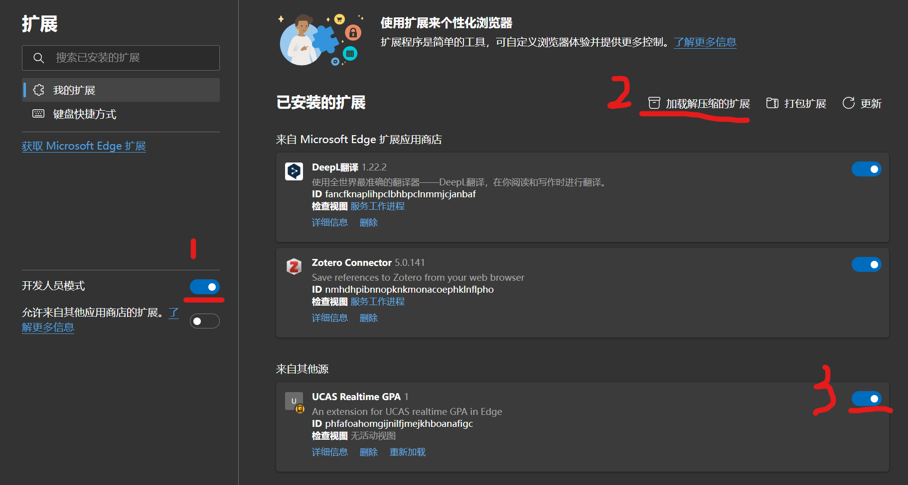

# UCAS-Realtime-GPA
- 用于实时计算UCAS绩点的插件
- 假期没事(2024.7)，编一些代码，故写此插件

  - 之前了解过学长的相关脚本（<https://github.com/TimeSea05/gpa-calc-ucas>），但需要挂载到油猴插件(Tampermonkey)上使用，但去年还是上半年发现无法使用，遂想自己写一个插件。
  - 2024.10.21发现又能使用了，搞不懂。不过增加了本插件的js文件，可直接挂到Tampermonkey使用。
- 目前支持本科成绩计算（2024.7.29）
- 使用方法
  - 插件（以edge为例）
    - 下载`UCAS-Realtime-GPA`目录 
    - 将目录通过开发者模式加载到edge浏览器插件处

      
    - 查询成绩时刷新即可
  - Tampermonkey
    - 下载Tampermonkey插件（Edge，Chrome均可）
    - 将`ucas-realtime-gpa.js`文件下载后挂到插件并打开。
    - 查询成绩时刷新即可
