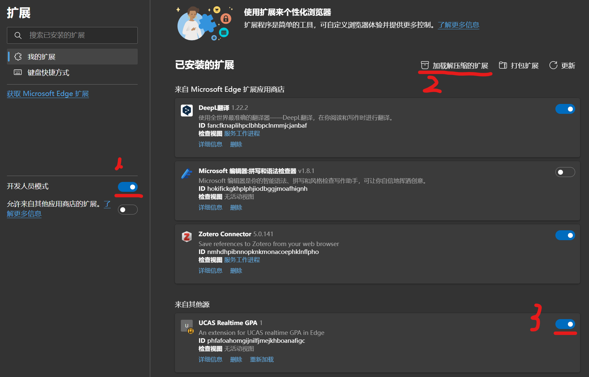
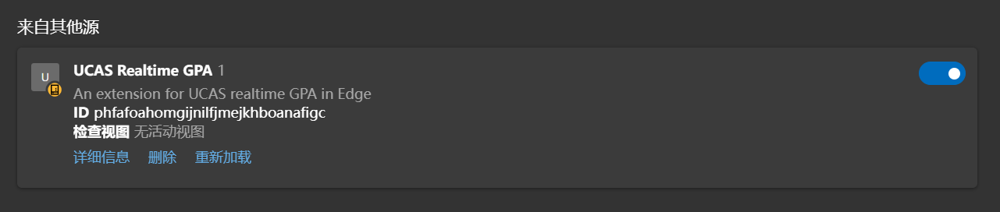

# UCAS-Realtime-GPA
用于实时计算UCAS绩点的插件
- 目前支持本科成绩计算（2024.7.29）
- 参考
  - https://learn.microsoft.com/zh-cn/microsoft-edge/extensions-chromium/getting-started/part1-simple-extension?tabs=v3
  - https://www.cnblogs.com/liuxianan/p/chrome-plugin-develop.html
- 使用方法（以edge为例）
  - 下载目录 
  - 将目录通过开发者模式加载到edge浏览器插件处
    - 
    - 
    - 
  - 查询成绩时刷新即可
